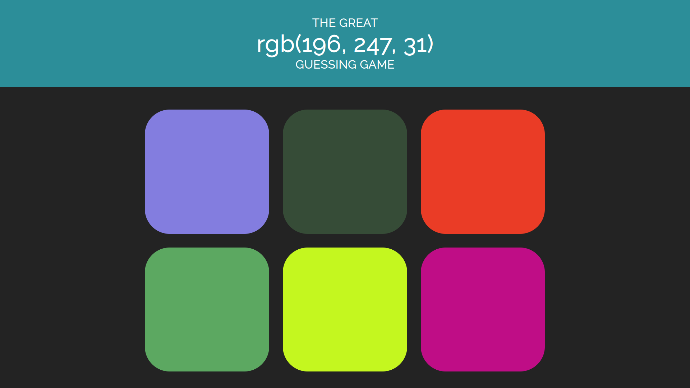
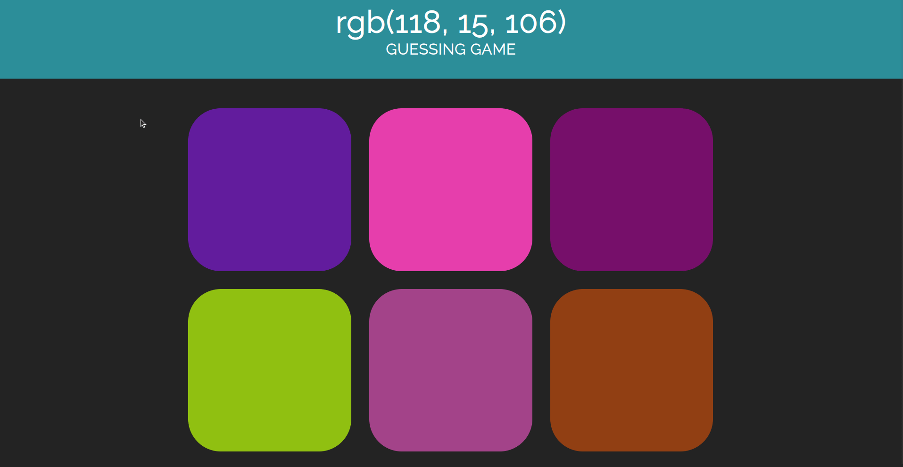

# PB - Events - Guess The Color Game

Create a color guessing game with JavaScript!

**Note:** The picture above is only an example - your page does not have to look exactly like this!

You can style your page with some simple CSS (don't spend too long on this - e.g. don't worry about making it responsive!).

You should focus primarily on using JavaScript to create the game logic .

You should **not** make any changes to `index.html`.

See the **Reference gif** at the bottom of this file for example gameplay.

## Instructions

-  Build a game where the player will be shown a single RGB value for a color.
-  Underneath, the player will see six boxes with random background colors (generated using JavaScript). One of these colors will be the same as the RGB value above.
    - Because the background colors will be random, the user should see different colors each time the browser is refreshed.
-  The user should click on the box with the color they think matches the RGB value.
    - Try to make sure a random box gets the correct background color - not the same box every time!
-  After the player has guessed, they should be shown an `alert` box informing them if they were successful.

**Hint:** You should try to use the **event object** to identify which box the user clicked when they make a guess. 

## Bonus

If you finish early, you could try to add extra features to the game.

- You could add a "reset" button to generate new colors. 
- You could give the player three "lives". With every wrong guess, they would lose one, and the game would be over when they run out of lives.
- Or anything else you can think of! :smile:

## Reference gif

