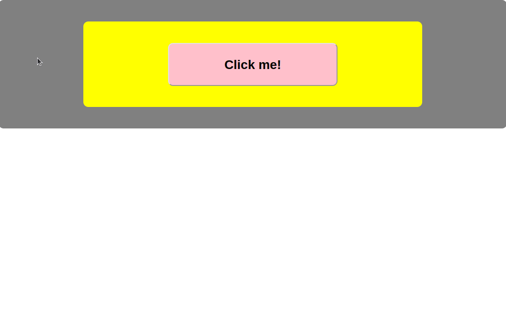

# PB - DOM - Event Propagation

This is a quick exercise to make sure you understand the ideas behind event propagation.

Please **only** work in `index.js` - do not change `index.html` or `style.css`.

## Task 1

- In `index.js`, attach an event listener (listening for a `click` event) to all 3 elements on the page. 
- Each event listener should display an `alert` identifying which element was clicked (i.e. "The button was clicked!", "The button's PARENT was clicked!" or "The button's GRANDPARENT was clicked!"). 
    - What happens when you click on the `<button>`?
    - Why does this happen?
    - Write brief answers to the above questions in a comment in `index.js`. If you do not know one or both answers, make sure to let me know (either during the discussion of this exercise, or privately)!

## Task 2

- Update your code to stop the behaviour in Task 1 from happening, so that **only** the event handler for the `<button>` element is called when you click it.

## Task 3

- Comment out your solution for Task 2. Now try to update your code to **reverse** the order in Question 1, so that the `#grandparent` element's event handler is called first, and the `<button>`'s event handler is called last.

