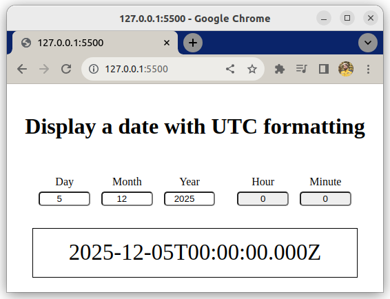

# Simple website modules

This exercise is about practicing modules in a web page.

## What you will be doing

This is an existing browser project with quite advanced code. The regular JS code outside the export statements is complete and not important for the exercise. Your task is only to add the missing statements to fix the JS importing.

This is a **browser** project to demonstrate modules, not a Node.js project.

## Tasks

### Task 1

- Open the website in Live Server and view the devtools console
- Fix the `script` element so that it supports modules
- Check the console again, you should get an error such as 

    > Uncaught SyntaxError: The requested module './elements.js' does not provide an export named 'day' (at updater.js:1:10)

### Task 2

- Read `main.js`, notice the import, do not edit the file
- Read `init.js`, add the missing `export` to the bottom
- Read the imports of `init.js`
- Read `elements.js`, add the missing `export` to the bottom
- Read the imports of `init.js`
- Read `updater.js`, add the missing `export` to the bottom
- Test the page, screenshot below

    
