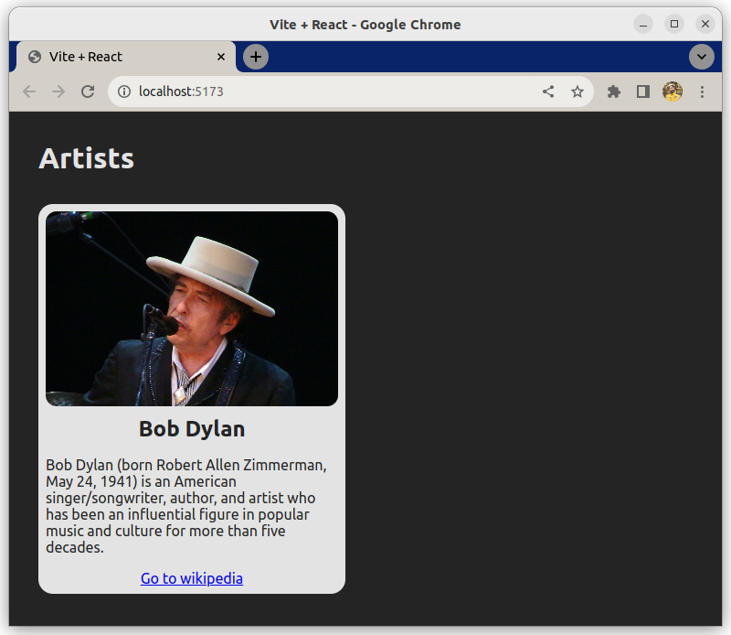

# Building a layout

This exercise is about building a layout with JSX based on an object containing data.

## Requirements

In `App.jsx` you have a `data` object that contains information about Bob Dylan.

```js
const data = {
  image: "https://upload.wikimedia.org/wikipedia/commons/thumb/0/02/Bob_Dylan_-_Azkena_Rock_Festival_2010_2.jpg/800px-Bob_Dylan_-_Azkena_Rock_Festival_2010_2.jpg",
  cardTitle: "Bob Dylan",
  cardDescription: "Bob Dylan (born Robert Allen Zimmerman, May 24, 1941) is an American singer/songwriter, author, and artist who has been an influential figure in popular music and culture for more than five decades.",
  button: {
    url: "https://en.wikipedia.org/wiki/Bob_Dylan",
    label: "Go to wikipedia"
  }
}
```

Use JSX, combined with information from the `data` object, to create a card in `App.jsx`.

The CSS for the card is already included. Below is a HTML template for the card - this is what should be rendered in the browser based on your JSX.

```html
<div class="card">
  
  <div class="card-body">
    <h5 class="card-title">Bob Dylan</h5>
    <p class="card-text">"Bob Dylan (born Robert Allen Zimmerman, May 24, 1941) is an American singer/songwriter, author, and artist who has been an influential figure in popular music and culture for more than five decades."</p>
    <a href="https://en.wikipedia.org/wiki/Bob_Dylan" class="card-button">Go to wikipedia</a>
  </div>
</div>
```

If you are successful, your card should look like this in the browser:

## Example

