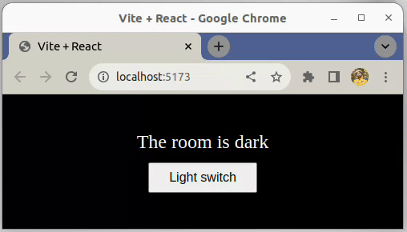

# SPA - Component - Light switch

This exercise is about practicing state management 

## Requirements

- Create a `Room` component in `src/components/Room.jsx`
- Inside, render a `div` with one class (value: 'lit')
  - **Question**: How should we write the HTML `class` attribute in a JSX element?
- In the `div`, add a paragraph that reads 'The room is lit'
- Now use the `useState` hook to store a `lightOn` state variable as a boolean
  - By default the room should be lit
- Next, add a `button` to the component with the text "Light switch"
- Clicking the button should toggle the 'light' on and off
  - The state variable should be updated every time the `button` is clicked
  - When the 'light' is off:
    - The text of the `div` should change to 'The room is dark'
    - The class of the `div` should change to 'dark'
  - You have already been given some CSS to make this change more visible in the browser!
- Finally, you should render the `Room` component in `App.jsx`
  - **Hint:** Don't forget to `import` it first

## Example

