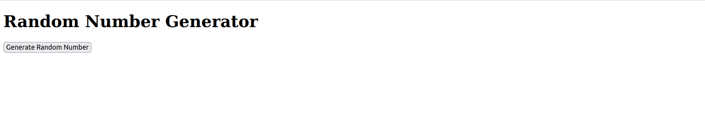
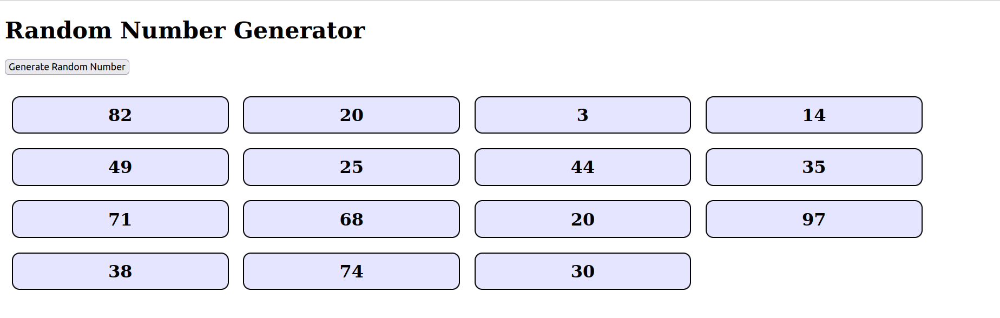

# SPA - Component - Random Number Generator

This exercise is about practicing the use of Array state variables and using props.

## Instructions

### Task 1

- You currently have an `App` component. Edit this so that it renders a `h1` element containing the text "Random Number Generator"

- Now create a `RandomNumber` component (in `src/components/RandomNumber.jsx`). For now, this should render a `div`. Later, this will display a random number to the user

- Next create a `RandomNumberList` component (in `src/components/RandomNumberList.jsx`), which should render a `div`. Soon this will contain some `<RandomNumber />` child components

- Finally, create a `Button` component (in `src/components/Button.jsx`) that renders a `button` with the text "Generate Random Number"

### Task 2

- Create a `useState` hook in the `App` component. This should keep track of a state variable called `randomNumbers`, which should be initialized with an **empty array**

- When the user clicks the button, a random whole number between 1 and 100 should be generated and added to the `randomNumbers` array in your `App` component's state  
  - **Hint:** To get a random number between 1-100 you can use: `Math.floor(Math.random() * 100) + 1` 
  - **Question:** How can you `click` the `Button` (child) component and change the state of the `App` (parent) component? Try defining a function in `App` which (1) generates the random number, and (2) adds it to the `randomNumbers` state array. This function can be passed down to `Button` via a **prop**, and called there when needed 
  - **Question 2:** Should you `push` the new random number into the `randomNumbers` array? If you are not sure, try it and see if it works!

### Task 3

- If you have completed the previous task correctly, your app should re-render every time you generate a new random number. 
- Make sure that, when this happens, your `RandomNumberList` component (child of `App`) contains one child `<RandomNumber />` component for **every** number in the `randomNumbers` state array (in `App`). 
  - Each `<RandomNumber />` component should display one random number to the user
  - **Hint:** Don't forget that any data contained in the `App` component can be passed down to its descendant components using **props**. :wink:
  - **Question:** Which advanced array method should you use to render all the `<RandomNumber />` components in `RandomNumberList` (`filter`, `map` or `reduce`)?

## Reference Images

**Note:** Reproducing the styling in the below images isn't necessary. You are welcome to style your app if you like, but **only** after you have achieved all the above functionality!

### 1. On page load

### 2. After clicking the button 15 times:

