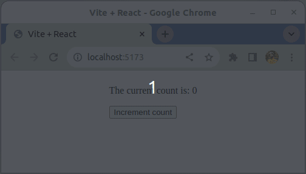

# SPA - Component - Olive counter

The goal of this app is to practice state handling, passing props and conditional rendering.

## Tasks

### Task 1

- Read `index.css` and notice the the `.backgroundOlive` selector

- Implement the `App` component
    - Use a `useState` hook to create a `count` state variable
        - This will "count" the number of clicks
        - It should be initialized with a number value of 0
    - The `App` component should render a `button` element
        - When the `button` is clicked, add 1 to the `count` state variable

### Task 2

- Implement the `Text` component in the `src/components` directory
    - This component should render only one `p` element
    - This component should have access to the `count` state variable in its parent component `App`
        - **Question:** How could you pass the value of `count` to the `Text` component?
    - If `count` is bigger than 5, the paragraph should have an olive background color
    - If `count` is smaller than 10, it should be rendered in the paragraph, e.g.

        > The current count is: 3

    - If `count` is greater than 10, the paragraph should contain the following sentence:

        > Count is bigger than 10
    - Finally, try to render the `Text` component as part of the `App` component (above the `button`) and test your app

### Reference Gif

