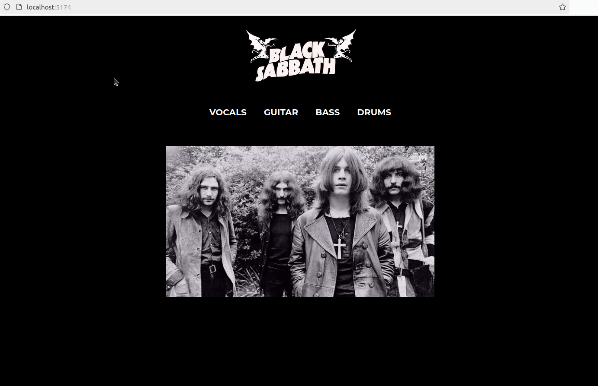

# Band landing page

This exercise is about practicing React Router. 

Use the knowledge you have gained during today's class to complete a small React app for your favorite band.

You can use the example below as a template, or design your own app.

## Hints

- As in the previous exercise, functionality is more important than style!
- First try to get your app working as expected, **then** feel free to use any extra time you have to improve the styling of your app. :smile:

## Extra Challenge

- Aim to practice what you have learned today by referring as little as possible to the live coding notes or your first exercise (unless you get stuck, of course :wink:)

## Example

