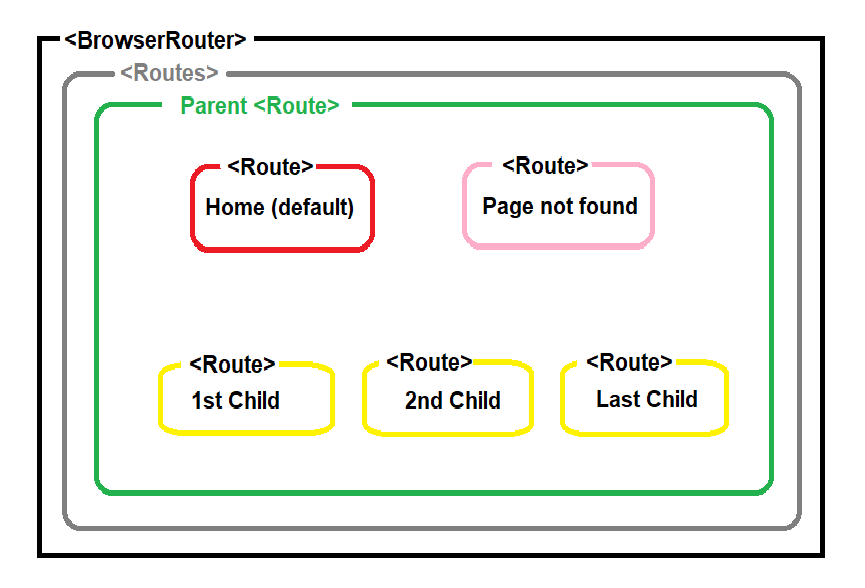

# SPA - Router Basics V6

In this exercise, you'll create a simple website with a navigation bar. You'll learn how to define different routes and render each nested route using **React Router v6**. 

## What you will be doing

* First, have a look at our router map:
  

* In the `parent` route, we have a navigation bar. This needs to be always shown in our web app.  
  
* We have 5 routes nested in the `parent` route: 
    - `Home` - a default page, no URL path is given.
    - `Page not found` - directed when there's no matching route to the URL path is found.
    - `ChildOne`, `ChildTwo`, `LastChild` - URL paths are given and a matching child route is rendered.

### Expected Output

This is what an [Expected Output](https://router-basics-v6.vercel.app/) looks like.

---

## Tasks

### Task 1 Install react-router-dom
* Install `react-router-dom` using
`npm i react-router-dom` 

### Task 2 Router Setup
* In `src` folder, create a `components` folder and add 6 components:
  - `Parent` 
  - `Home`
  - `PageNotFound`
  - `ChildOne` `ChildTwo` `LastChild`

* In `main.jsx`,
  - Please import **BrowserRouter** from `react-router-dom` and nest your `App` component inside it

* In `App.jsx`, 
  - Please import the 6 components above. 
  - Import **Routes**, **Route** from `react-router-dom`.
  - Set up the routes following the router map image above. 5 child routes are nested in one parent route. Each route has a component element and a URL path.
    - For the parent route, the path is set as `/` and the component to be rendered is `<Parent />`.
    - For the default route, give an attribute `index` instead of defining a path. When this route is selected, the path remains `/` and the component to be rendered is `<Home />`.  
    - For each child route, a different path is required. (`/one`, `/two`, `/three`). Each child route should render its associated component (`<ChildOne />`, `<ChildTwo />` or `<ChildThree />`)
    - You should set up one final route to render the component `<PageNotFound />` if the user tries to go anywhere other than the routes we have defined. Can you remember what to set the path to? 

### Task 3 Link & Render Routes
* In `Parent.jsx`, the navigation bar for `Home`, `ChildOne`, `ChildTwo`, `LastChild` will be located. 
  - Please import **Link** and **Outlet** from `react-router-dom`.
  - Use `Link` to set the URL path for each route.
  - Add `Outlet` - this renders the current child route selected. 

## Hints

- Don't worry too much about styling your app, unless you finish the exercise early!
- Feel free to check out today's live coding repo if you want to remember how to do something :smile: